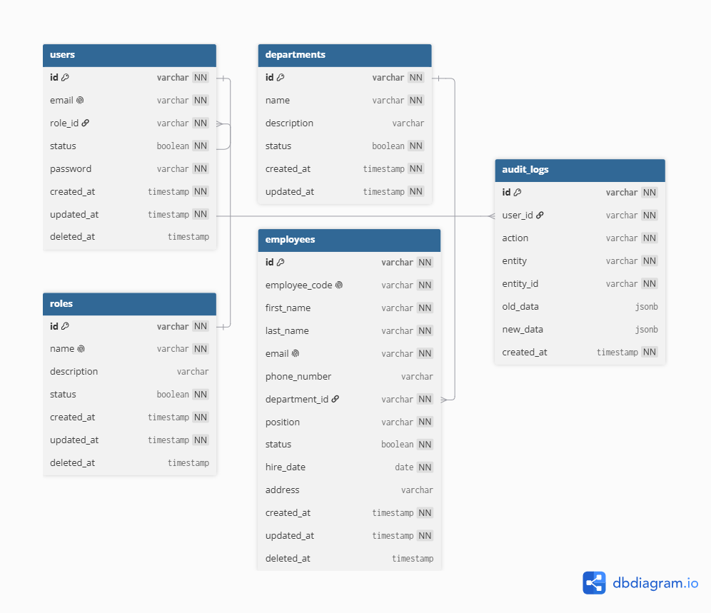

# Employee Management System Backend

Employee Management System (EMS) is a Node.js + Express + Sequelize backend for managing employees, departments, users, roles, and audit logs. It exposes REST API endpoints with JWT authentication, role-based authorization, and CSV export support.

## Demo Live

- Frontend / production demo: https://ems.rayhancreative.web.id
- API base URL: http://localhost:8000 (local development)

## Features

- Authentication and JWT-based session handling
- Role-based access control with `ADMIN`, `HR`, and `EMPLOYEE`
- User management
- Department management
- Employee management
- Audit log tracking for create/update/delete actions
- CSV export for employees and audit logs
- Dashboard summary for employee and activity insights
- OpenAPI contract available at `/api-docs/openapi.json`

## Tech Stack

- Node.js
- Express
- Sequelize ORM
- PostgreSQL
- JWT
- Zod validation
- ExcelJS for CSV export
- CORS, Helmet, rate limiting

## Project Structure

```bash
.
├── config/
│   └── config.js
├── db/
│   ├── migrations/
│   ├── models/
│   └── seeders/
├── public/
│   └── assets/
│       └── erd.png
├── src/
│   ├── docs/
│   ├── middleware/
│   ├── modules/
│   ├── routes.js
│   └── utils/
├── index.js
├── package.json
├── .env.example
├── README.md
└── .gitignore
```

## ERD / Database Design

The ERD (Entity Relationship Diagram) shows the structure of the database and the relationships between different entities.

The ERD image is already available here:

<p align="center">
  
</p>

You can also open it visually in the project or share it with the team for database reference.

## Local Setup

### 1) Clone the project

```bash
git clone <repository-url>
cd employee-management-system
```

### 2) Install dependencies

```bash
npm install
```

### 3) Configure environment variables

Copy `.env.example` to `.env` and update the values as needed.

```bash
copy .env.example .env
```

Example:

```env
NODE_ENV=development
PORT=8000
JWT_KEY=your_jwt_secret
DB_USER=postgres
DB_PASS=postgres
DB_NAME=postgres
DB_HOST=127.0.0.1
DB_PORT=5432
DB_CONNECTION=postgresql
```

### 4) Create database and run migrations

```bash
npx sequelize-cli db:migrate
```

### 5) Seed the database

```bash
npm run seed
```

### 6) Run the server

Development mode:

```bash
npm run dev
```

Or direct run:

```bash
npm start
```

The application will run on:

```bash
http://localhost:8000
```

### 7) Health check

```bash
curl http://localhost:8000/health
```

Expected response:

```json
{
  "success": true,
  "message": "OK",
  "metadata": {},
  "data": {
    "status": "ok",
    "database": "connected",
    "timestamp": "2026-10-08T00:00:00.000Z"
  }
}
```

## API Documentation

OpenAPI specification is available here:

- `http://localhost:8000/api-docs/openapi.json`

This is the contract used for frontend integration and documentation.

## Main API Endpoints

### Auth

- `POST /api/v1/auth/login` — login and receive JWT token
- `GET /api/v1/auth/get-me` — get current logged-in user
- `POST /api/v1/auth/logout` — clear auth token

### Dashboard

- `GET /api/v1/dashboard` — summary of employee count, department overview, and recent activity

### Roles

- `GET /api/v1/roles`
- `POST /api/v1/roles/create`
- `GET /api/v1/roles/:id/detail`
- `PUT /api/v1/roles/:id/update`
- `DELETE /api/v1/roles/:id/delete`

### Users

- `GET /api/v1/users`
- `POST /api/v1/users/create`
- `GET /api/v1/users/:id/detail`
- `PUT /api/v1/users/:id/update`
- `DELETE /api/v1/users/:id/delete`
- `PATCH /api/v1/users/:id/status`

### Departments

- `GET /api/v1/departments`
- `POST /api/v1/departments/create`
- `GET /api/v1/departments/:id/detail`
- `PUT /api/v1/departments/:id/update`
- `DELETE /api/v1/departments/:id/delete`

### Employees

- `GET /api/v1/employees`
- `POST /api/v1/employees/create`
- `GET /api/v1/employees/:id/detail`
- `PUT /api/v1/employees/:id/update`
- `DELETE /api/v1/employees/:id/delete`
- `PATCH /api/v1/employees/:id/status`
- `GET /api/v1/employees/export`

### Audit Logs

- `GET /api/v1/audit-logs`
- `GET /api/v1/audit-logs/export`

## Common Query Parameters

The list endpoints support pagination, sorting, and filtering.

### Pagination

- `page` — default `1`
- `per_page` — default `10`, max `100`

### Search

- `q` — free text search

### Sorting

- `sort_by`
- `sort_order` — `ASC` or `DESC`

### Examples

```bash
GET /api/v1/employees?page=1&per_page=10&q=ali
GET /api/v1/users?role=ADMIN&status=true
GET /api/v1/departments?sort_by=name&sort_order=ASC
GET /api/v1/audit-logs?action=CREATE&date_from=2026-10-01
```

## Role Model

Supported roles in the system:

- `ADMIN`
- `HR`
- `EMPLOYEE`

Access is controlled using JWT and role middleware.

## Next Features

Planned improvements for the next development cycle:

- [ ] **Granular RBAC permissions** — define permissions per resource and action, such as `employee.read`, `employee.create`, and `audit-log.export`.
- [ ] **Role and permission management** — allow administrators to create custom roles and assign permissions without changing application code.
- [ ] **Permission-aware API documentation** — document the required role or permission for each protected endpoint in the OpenAPI specification.
- [ ] **Automated authentication and authorization tests** — cover login, token validation, role restrictions, permission checks, and unauthorized access responses.
- [ ] **Refresh token and session management** — support secure token renewal and server-side session revocation.
- [ ] **Employee data import** — add validated CSV/XLSX import with a preview step and an import result report.
- [ ] **Notifications** — provide email or in-app notifications for account status changes, employee updates, and important audit events.
- [ ] **Soft delete and data recovery** — preserve deleted records where required and provide a controlled recovery workflow.
- [ ] **Production observability** — add structured logging, metrics, error tracking, and health checks for dependent services.

## Running Tests

This project currently does not include a dedicated automated test framework like Jest or Vitest. For validation, use manual smoke testing through the running app.

Recommended local validation flow:

```bash
npm install
npx sequelize-cli db:migrate
npm run seed
npm run dev
```

Then test the following endpoints:

```bash
curl http://localhost:8000/health
curl http://localhost:8000/api/v1/auth/login
curl http://localhost:8000/api/v1/dashboard
```

If you want to add automated tests later, this project is structured to support it with a dedicated `test/` folder and a standard Node.js test runner.

## Environment Notes

- The backend expects PostgreSQL to be running locally or in your target environment.
- JWT secret and DB credentials must be valid in `.env`.
- `NODE_ENV` should be set according to the environment (`development`, `production`, etc.).

## Production / Deployment Notes

- Ensure the database is migrated and seeded before deployment.
- Set `JWT_KEY` securely in production.
- Configure environment-specific `PORT`, `DB_*`, and `NODE_ENV` values.
- The main API should be served behind a proper reverse proxy (Nginx / Apache / hosting platform) when deployed.

## Useful Commands

```bash
npm install
npm run dev
npm start
npm run migrate
npm run seed
npm run seed:undo
npm run migrate:undo
```

## Contact / Maintainer

For questions or technical support, contact the project maintainer or the development team managing this repository.

## License

This project is intended for internal or project-based use unless otherwise specified by the repository owner.
